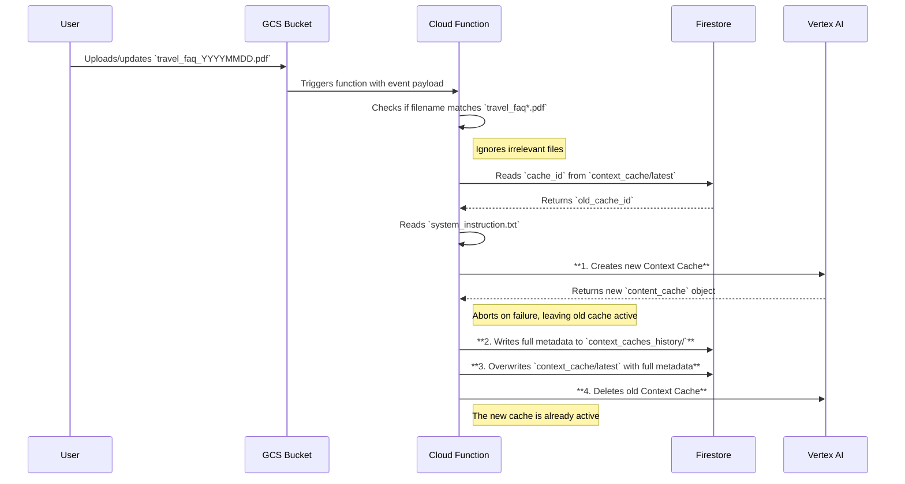

# Cache Updater

## 1. Overview

This project provides a resilient, automated mechanism for updating the Vertex AI Context Cache used by the main Travel Insurance FAQ chatbot. Its primary purpose is to ensure that the chatbot's knowledge base is always synchronized with the latest version of the master FAQ document.

The application is designed to be deployed as a Cloud Function. It is triggered whenever a file starting with `travel_faq` and ending with `.pdf` is uploaded or modified in a specific Google Cloud Storage (GCS) bucket.

To ensure high availability, the function follows a safe update pattern: it first creates the new Vertex AI Context Cache. Only after the new cache is successfully created and the database is updated does it delete the old cache. This prevents any downtime where the chatbot might be left without a valid cache.

For auditing and versioning, the function maintains a complete history of all created caches in a dedicated Firestore collection, while providing a simple, single document for the chatbot to read to get the latest active cache information.

## 2. Process Flow

The following diagram illustrates the resilient, end-to-end process, from a user uploading a new file to the cache being safely updated in Firestore.



## 3. Firestore Data Model

The application uses two collections in Firestore to manage cache information efficiently and maintain a clear audit trail.

### `context_cache` (Pointer Collection)

This collection contains a single document with the ID `latest`. The chatbot only needs to read this one document to get all the information about the currently active cache. This document is overwritten on every successful update.

-   **Path:** `context_cache/latest`
-   **Content:**
    ```json
    {
      "cache_id": "projects/.../cachedContents/ID_OF_THE_LATEST_CACHE",
      "model": ".../models/gemini-2.5-flash",
      "gcs_uri": "gs://your-bucket/travel_faq_20250708.pdf",
      "create_time": "2025-07-08T18:23:12Z",
      "expire_time": "2035-07-06T18:23:10Z",
      "usage_metadata": { ... },
      "system_instruction": "You are a helpful and friendly AI assistant..."
    }
    ```

### `context_caches_history` (History Collection)

This collection stores an immutable, timestamped record for every cache that is created. This provides a complete historical log for auditing and debugging purposes.

-   **Path:** `context_caches_history/context_cache_YYYYMMDDHHMMSS`
-   **Content:** The content is identical to the `latest` document, providing a snapshot of the cache at the time of its creation.

## 4. Setup & Configuration

Before running or deploying the application, you must configure its environment variables.

1.  Create a file named `.env` in the project's root directory.
2.  Add the following key-value pairs to the file. These variables are essential for connecting to the correct GCP services and configuring the GenAI model.

```sh
# .env file

GCP_PROJECT="sandipdatta-sandbox"
FUNCTION_REGION="europe-west4"
MODEL_NAME="gemini-2.5-flash"
DB_NAME="travel-insurance-faq"
```

**Important:** Ensure the service account running the function has the necessary IAM permissions for Vertex AI (AI Platform Editor) and Firestore (Cloud Datastore User).

## 5. Local Testing

To test the application locally without deploying it, you can use the `functions-framework`.

1.  **Navigate to the Directory**:
    Open your terminal and change into the project's root directory.
    ```sh
    cd /path/to/your/project/cache_updater
    ```

2.  **Install Dependencies**:
    Install all the required Python packages.
    ```sh
    pip install -r requirements.txt
    ```

3.  **Run the Local Server**:
    Start the functions framework. This will host your function on a local server, typically on port 8081.
    ```sh
    functions-framework --source=main.py --target=update_context_cache --port=8081
    ```

4.  **Trigger the Function**:
    Open a **new terminal window** and use the following `curl` command to send a mock GCS event payload to the local server. This simulates a file upload.
    ```sh
    curl localhost:8081 \
      -X POST \
      -H "Content-Type: application/json" \
      -H "ce-id: 12345" \
      -H "ce-specversion: 1.0" \
      -H "ce-time: 2025-01-01T12:00:00Z" \
      -H "ce-type: google.cloud.storage.object.v1.finalized" \
      -H "ce-source: //storage.googleapis.com/projects/_/buckets/your-gcs-bucket-name" \
      -H "ce-subject: objects/travel_faq_20250708.pdf" \
      -d '{
            "bucket": "your-gcs-bucket-name",
            "name": "travel_faq_20250708.pdf"
          }'
    ```
    **Note:** Remember to replace `your-gcs-bucket-name` with the actual name of your GCS bucket and use a valid filename.

5.  **Verify the Update**:
    After triggering the function, run the verification script to check if the Firestore documents were updated correctly.
    ```sh
    python verify_firestore.py
    ```
    The output will show the content of the `context_cache/latest` document and confirm that a corresponding record was created in the `context_caches_history` collection.

## 6. Deployment

To deploy this function to Google Cloud, use the `gcloud` CLI.

1.  Navigate to the project's root directory.
2.  Run the following command, replacing `YOUR_GCS_BUCKET_NAME` with the name of the GCS bucket that will trigger the function.

```sh
gcloud functions deploy update-context-cache \
  --gen2 \
  --runtime=python312 \
  --region=europe-west4 \
  --source=. \
  --entry-point=update_context_cache \
  --trigger-event-filters="type=google.cloud.storage.object.v1.finalized" \
  --trigger-event-filters="bucket=YOUR_GCS_BUCKET_NAME" \
  --env-vars-from-file=.env
```

This command deploys the function with a trigger that listens for object finalization events (like uploads) in the specified GCS bucket.

## 7. Dependencies

This project relies on the following Python packages:

- `functions-framework`
- `google-cloud-firestore`
- `google-genai`
- `python-dotenv`
