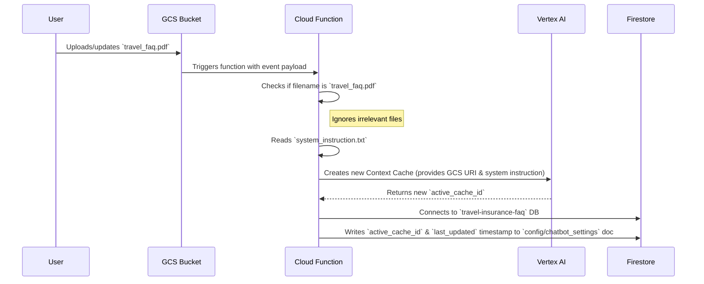

# Cache Updater Cloud Function

## 1. Overview

This Cloud Function provides an automated mechanism for updating the Vertex AI Context Cache used by the main Travel Insurance FAQ chatbot. Its primary purpose is to ensure that the chatbot's knowledge base is always synchronized with the latest version of the master FAQ document (`travel_faq.pdf`).

The function is triggered whenever a file is uploaded or modified in a specific Google Cloud Storage (GCS) bucket. It then creates a new Vertex AI Context Cache using the updated file and stores the new cache's unique ID in a central Firestore document. The main chatbot application reads this Firestore document to dynamically retrieve and use the latest active cache, ensuring that users always get answers from the most current information without requiring any manual intervention or application restarts.

## 2. Process Flow

The following diagram illustrates the end-to-end process, from a user uploading a new file to the cache ID being updated in Firestore.



## 3. Setup & Configuration

Before running or deploying the function, you must configure its environment variables.

1.  Create a file named `.env` in the `cache_updater` directory.
2.  Add the following key-value pairs to the file. These variables are essential for connecting to the correct GCP services and configuring the GenAI model.

```sh
# .env file

GCP_PROJECT="sandipdatta-sandbox"
FUNCTION_REGION="europe-west4"
MODEL_NAME="gemini-2.5-flash"
DB_NAME="travel-insurance-faq"
```

**Important:** Ensure the service account running the function has the necessary IAM permissions for Vertex AI (AI Platform Editor) and Firestore (Cloud Datastore User).

## 4. Local Testing

To test the function locally without deploying it, you can use the `functions-framework`.

1.  **Navigate to the Directory**:
    Open your terminal and change into the `cache_updater` directory.
    ```sh
    cd /path/to/your/project/cache_updater
    ```

2.  **Install Dependencies**:
    Install all the required Python packages.
    ```sh
    pip install -r cloud_functions/requirements.txt
    ```

3.  **Run the Local Server**:
    Start the functions framework. This will host your function on a local server, typically on port 8081.
    ```sh
    functions-framework --source=cloud_functions/main.py --target=update_context_cache --port=8081
    ```

4.  **Trigger the Function**:
    Open a **new terminal window** and use the following `curl` command to send a mock GCS event payload to the local server. This simulates a file upload.
    ```sh
    curl localhost:8081 \
      -X POST \
      -H "Content-Type: application/json" \
      -H "ce-id: 12345" \
      -H "ce-specversion: 1.0" \
      -H "ce-time: 2025-01-01T12:00:00Z" \
      -H "ce-type: google.cloud.storage.object.v1.finalized" \
      -H "ce-source: //storage.googleapis.com/projects/_/buckets/your-gcs-bucket-name" \
      -H "ce-subject: objects/travel_faq.pdf" \
      -d '{
            "bucket": "your-gcs-bucket-name",
            "name": "travel_faq.pdf"
          }'
    ```
    **Note:** Remember to replace `your-gcs-bucket-name` with the actual name of your GCS bucket.

5.  **Verify the Update**:
    After triggering the function, run the verification script to check if the Firestore document was updated correctly.
    ```sh
    python cloud_functions/verify_firestore.py
    ```
    The output should show the new `active_cache_id` and a recent `last_updated` timestamp.

## 5. Deployment

To deploy this function to Google Cloud, use the `gcloud` CLI.

1.  Navigate to the `cache_updater` directory.
2.  Run the following command, replacing `YOUR_GCS_BUCKET_NAME` with the name of the GCS bucket that will trigger the function.

```sh
gcloud functions deploy update-context-cache \
  --gen2 \
  --runtime=python312 \
  --region=europe-west4 \
  --source=. \
  --entry-point=update_context_cache \
  --trigger-event-filters="type=google.cloud.storage.object.v1.finalized" \
  --trigger-event-filters="bucket=YOUR_GCS_BUCKET_NAME" \
  --env-vars-from-file=.env
```

This command deploys the function with a trigger that listens for object finalization events (like uploads) in the specified GCS bucket.

## 6. Dependencies

This project relies on the following Python packages:

- `functions-framework`
- `google-cloud-firestore`
- `google-genai`
- `python-dotenv`

